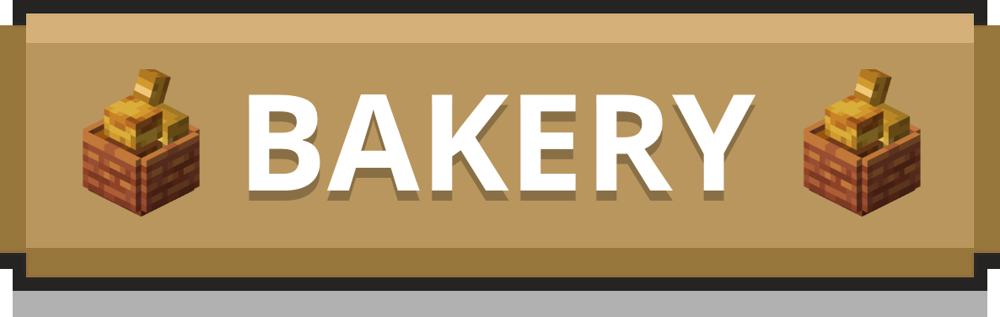
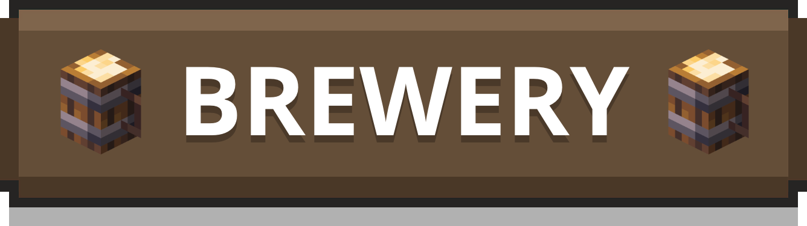
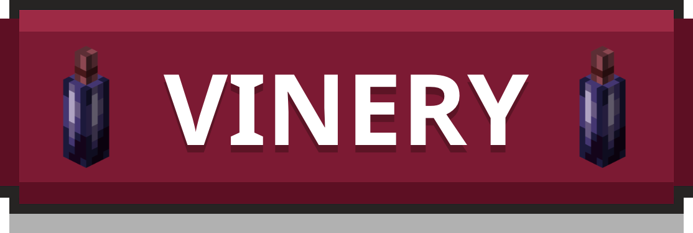
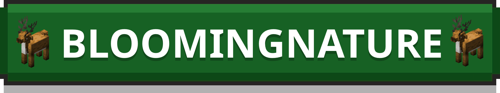
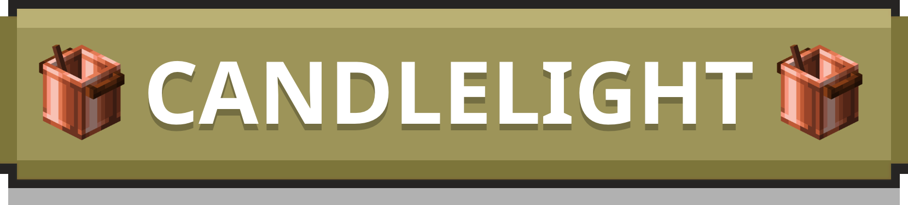
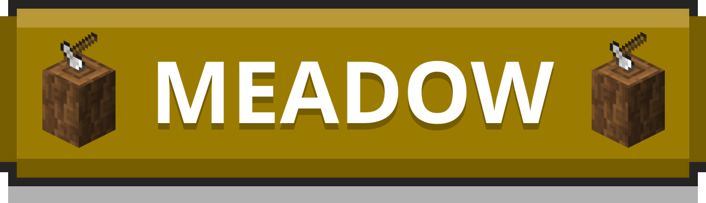
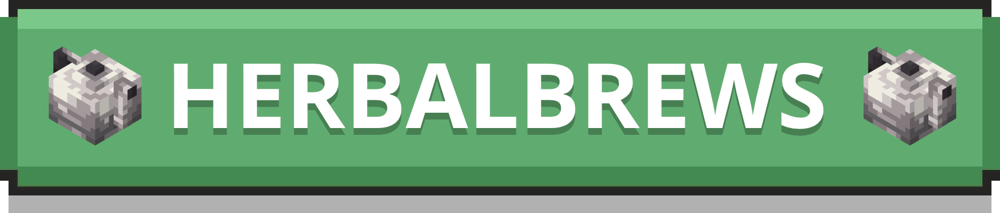
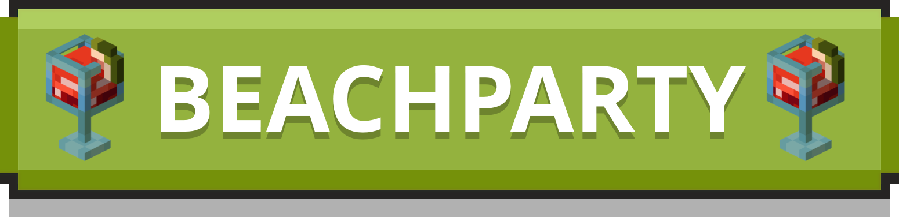

    

       
       
    

       
       
    

       
    

<h1 align="center">Be Part of Our Journey</h1>

    
    <a title="Patreon" href="https://www.patreon.com/user?u=78595058">
        <picture>
            <source srcset="https://i.ibb.co/4R738W0/patreon-logo-icon-170869-dark.png" media="(prefers-color-scheme: dark)">
            
        </picture>
    </a>

